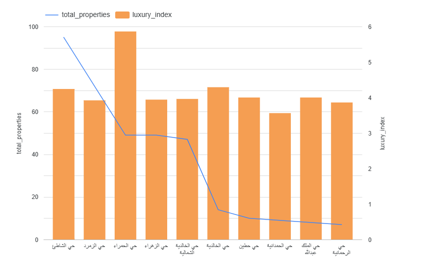
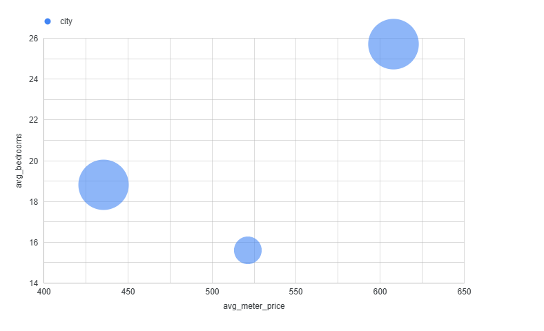
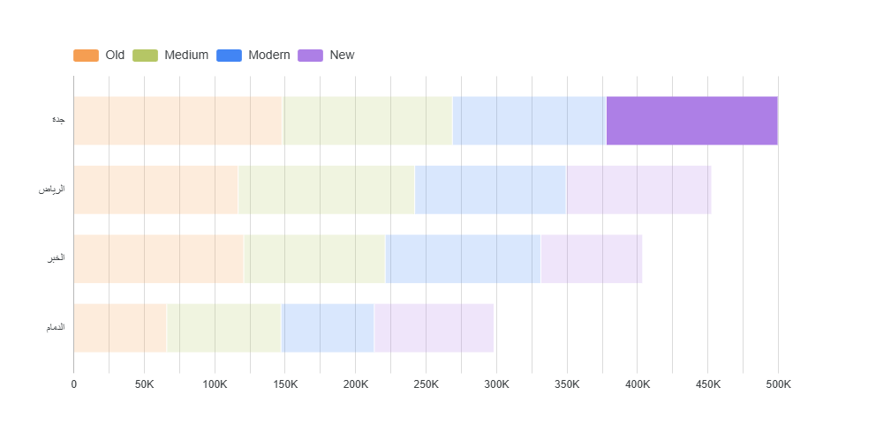
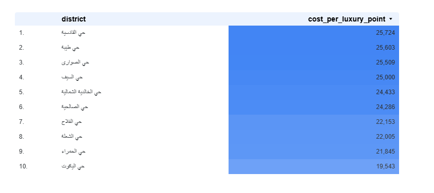

# 🏡 Saudi Real Estate ETL & Market Intelligence

An end-to-end Data Engineering and Analytics project. This repository demonstrates a complete pipeline: cleaning raw Saudi real estate data with **Python**, processing it in **Google BigQuery**, and visualizing multi-dimensional market insights in **Looker Studio**.

---

## 📊 Market Insights & Visualizations

The following analysis was performed to identify investment opportunities and luxury trends across major Saudi cities.

### 1. Luxury Index vs. Market Supply

* **Description:** A combo chart comparing the **Luxury Score** (Bars) against **Total Properties** (Line).
* **Insight:** Highlights premium districts like **Al-Hamra**, which boasts the highest luxury index despite having a moderate supply.

### 2. Investment Opportunity Mapping

* **Description:** A Scatter Chart (Bubble Chart) analyzing the relationship between **Price per Meter** and **Average Bedrooms**.
* **Insight:** Identifies "Undervalued" areas where property sizes are high relative to the price per square meter.

### 3. Property Age Distribution by City

* **Description:** A Stacked Bar Chart showing the distribution of property ages (**New, Modern, Medium, Old**).
* **Insight:** Visualizes market maturity and construction trends across different Saudi regions.

### 4. Cost of Luxury by District

* **Description:** A Heatmap Table ranking districts by the **Cost per Luxury Point**.
* **Insight:** Provides a "Value for Money" metric, identifying where luxury amenities are most affordable.

---

## 📂 Project Structure

```text
├── data/
│   ├── UnCleandSA_Aqar.csv         # Raw dataset (Input)
│   └── CleanedSA_Aqar.csv          # Cleaned dataset (Output)
├── scripts/
│   └── clean_data.py               # Python ETL logic & cleaning
├── sql/
│   ├── luxury_index.sql            # Core luxury scoring logic
│   ├── investment_opportunities.sql # Scouting undervalued districts
│   ├── property_age_impact.sql     # Analyzing price vs. property age
│   └── value_for_luxury.sql        # Cost-benefit analysis of amenities
├── dashboard_preview_1.png         # Chart: Luxury Index
├── dashboard_preview_2.png         # Chart: Investment Scatter
├── dashboard_preview_3.png         # Chart: Age Distribution
├── dashboard_preview_4.png         # Chart: Value Heatmap
└── README.md                       # Project documentation
```

🛠️ Technical Stack
Language: Python 3.x (Pandas for ETL)

Database: Google BigQuery (SQL)

Visualization: Looker Studio

Environment: VS Code

⚙️ How to Reproduce
Clone the Repo: git clone https://github.com/yourusername/saudi-real-estate-etl.git

Run ETL: Execute python scripts/clean_data.py to generate the cleaned dataset.

BigQuery: Upload the cleaned CSV to BigQuery and execute scripts found in the /sql folder.

Dashboard: Connect BigQuery to Looker Studio to view the visualizations.


